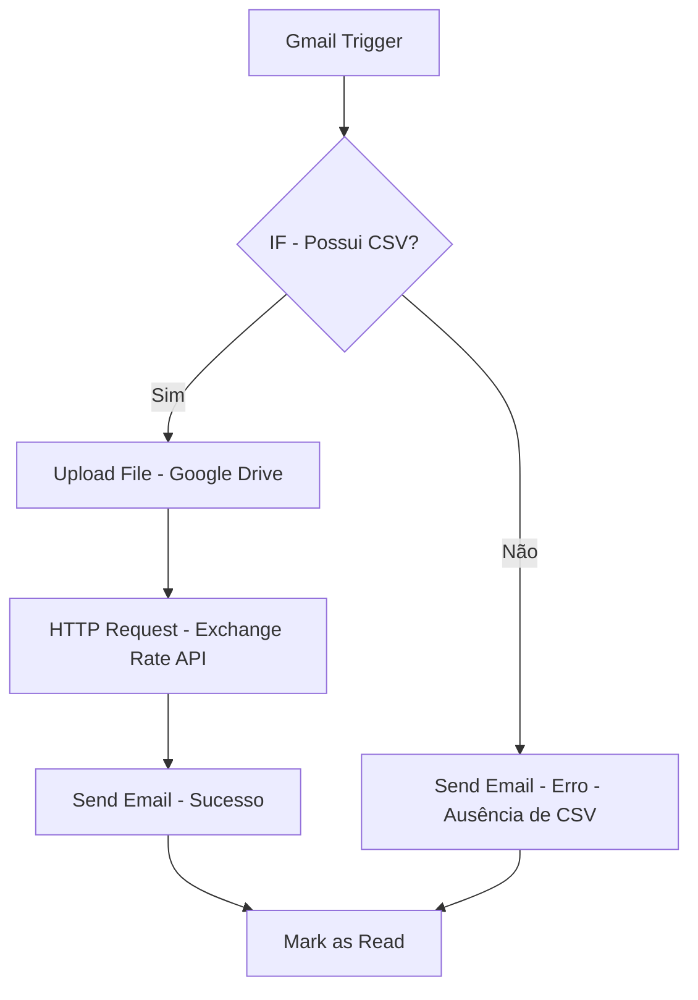

# 📄 Projeto n8n – Automação de Processamento de E-mails com Anexo CSV

## 🚀 Visão Geral

Este projeto implementa um fluxo de automação no **n8n** para processar e-mails recebidos com anexo em formato **CSV**.  

O objetivo é:  
- Ler e-mails não lidos recebidos no **Gmail**.  
- Extrair o arquivo CSV do anexo.  
- Salvar o arquivo em uma pasta definida no **Google Drive** (ou localmente, se desejado).  
- Consultar a cotação atual do dólar (**USD → BRL**) utilizando a **Exchange Rate API**.  
- Responder automaticamente ao remetente confirmando o processo e informando a cotação do dólar.  
- Marcar o e-mail como lido após o processamento.  

---

## ⚙️ Nodes do Fluxo

### 1. Gmail Trigger
- Aciona o fluxo a cada 5 minutos para verificar e-mails não lidos.  
- **Configuração:**  
  - Poll Times: Custom  
  - Cron Expression: `*/5 * * * *`  
  - Fonte de referência: [n8n Cron Docs](https://docs.n8n.io)  
- **Credenciais:**  
  - Conta Gmail (OAuth2 via login direto do Gmail).  

---

### 2. IF
- Verifica se existe anexo `.csv`.  
- **Condição aplicada:**  
  ```
  {{$binary.attachment_0.fileName}} termina com .csv

### 3. Upload File (Google Drive)

* Realiza o upload do anexo para o Google Drive.
* **Observação:**

  * Foi necessário criar um projeto no Google Cloud Console.
  * Habilitar a API do Drive.
  * Configurar as credenciais de OAuth2.

> Esta etapa foi a mais trabalhosa, mas após corrigir erros de credenciamento, funcionou corretamente.

---

### 4. HTTP Request

* Consulta a **Exchange Rate API**:

  * **Endpoint:** `https://open.er-api.com/v6/latest/USD`
  * Retorna valores de cotação, como `rates.BRL`.

---

### 5. Send Email (Erro – ausência de CSV)

Caso o e-mail não contenha um `.csv`, envia resposta automática:

```
Prezado(a) {{ $('Gmail Trigger').item.json.from.value[0].name }},

Não foi possível concluir o processo de automação, pois o e-mail recebido não continha nenhum arquivo .csv anexado.

🔄 Solução:
Por favor, reenviar o e-mail garantindo que o arquivo esteja anexado e no formato correto (.csv).

Atenciosamente,
Samuel Prado
```

---

### 6. Send Email (Sucesso – CSV presente)

Caso o fluxo seja concluído com sucesso, envia resposta automática:

```
Prezado(a) {{ $('Gmail Trigger').item.json.from.value[0].name }},

O processo de automação foi concluído com sucesso.

📊 Cotação do Dólar no dia {{time_last_update_utc}}:
1 USD = {{rates.BRL}} BRL

Fonte: Exchange Rate API (https://open.er-api.com)

Atenciosamente,
Samuel Prado
```

---

### 7. Mark Email as Read

* Marca a mensagem processada como lida no Gmail.

---

## 🗂️ Estrutura do Fluxo



---

## 🔑 Observações Importantes

* Para usar o **Google Drive Node**, é necessário:

  1. Criar um projeto no Google Cloud Console.
  2. Habilitar a Google Drive API.
  3. Criar credenciais OAuth2 e registrar o domínio do n8n (ex.: `https://seudominio.app.n8n.cloud/`).

* O fluxo está configurado para rodar a cada **5 minutos**, mas pode ser ajustado conforme necessidade.

* A API de câmbio utilizada é gratuita e atualizada periodicamente.

```
```
